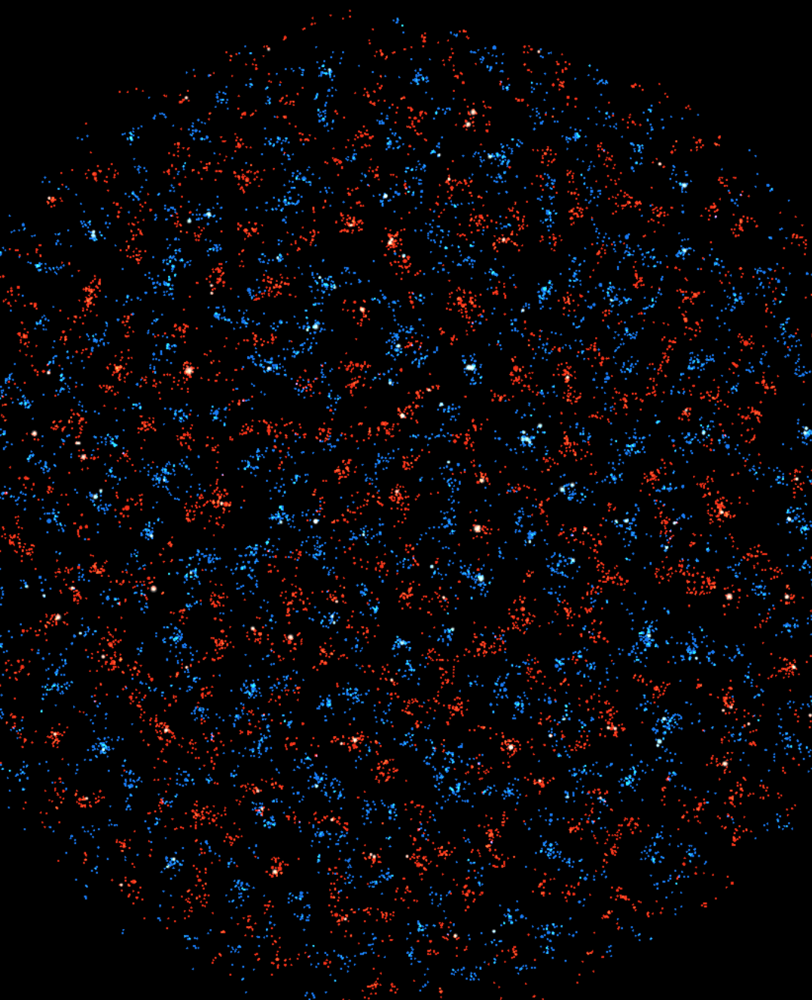

# Newtonian Particle with Negative Mass Simulator

This project is a simple 2D N-body simulator written in JavaScript that explores the cosmological implications of **negative mass**. Inspired by the theories of **Andrei Sakharov** and **Jean-Pierre Petit (Janus Model)**, it demonstrates how gravitational repulsion from negative mass can lead to the formation of "soap bubble" structures, filaments, and voids.

---

## 🌌 Conceptual Overview

The simulation operates on the Janus interaction laws, which differ from standard Newtonian gravity by introducing a "twin world" interaction logic:

| Interaction | Result | Effect in Simulation |
| :--- | :--- | :--- |
| **m+ / m+** | Attraction | Standard galactic clumping |
| **m- / m-** | Attraction | Negative mass forms its own clusters |
| **m+ / m-** | Repulsion | Positive matter is pushed away |
| **m- / m+** | Attraction | Positive matter is pulled toward negative mass |

Because the negative mass repels the positive mass but the positive mass is attracted to the negative mass, a "runaway" effect occurs. This causes negative mass to occupy the centers of large cosmic voids, acting as the **Great Repeller** and carving out the "soap bubble" distribution of galaxies.

---

## ✨ Features

* **Interactive Physics:** Uses a velocity-Verlet-style integration for $N$-body motion.
* **Janus Logic:** Explicitly handles the asymmetrical gravitational laws of the twin-universe model.
* **Toroidal Topology:** Particles wrap around edges to simulate an infinite, expanding space.
* **Generative Origins:** Created with the help of AI to visualize complex theoretical physics without manual boilerplate.

---

## 📚 References & Further Reading

### Andrei Sakharov
* **Violation of CP invariance, C asymmetry, and baryon asymmetry of the universe (1967)**
  * [Read the paper (NASA ADS)](https://adsabs.harvard.edu/abs/1967JETPL...5...24S)
  * *Explores the hypothesis of a "mirror" universe with reversed arrows of time and mass properties.*

### Jean-Pierre Petit
* **Janus Cosmological Model Mathematically & Physically Consistent (2024)**
  * [Read the paper (HAL Archives)](https://hal.science/hal-04583560/)
* **Janus cosmological model (2021)**
  * [Read the paper (HAL Archives)](https://hal.science/hal-03285671/)
  * *Outlines the specific bimetric equations that allow for the "soap bubble" large-scale structure.*

---

## 🚀 Usage

### 1. Structure
Ensure your project has the following files:
* `index.html`: The container with a `<canvas>` element.
* `demo.js`: The simulation logic.

### 2. Running Locally
Simply open your `index.html` in any modern web browser.

## 🚀 Configuration
see `demo.js`.

## License
Apache v2